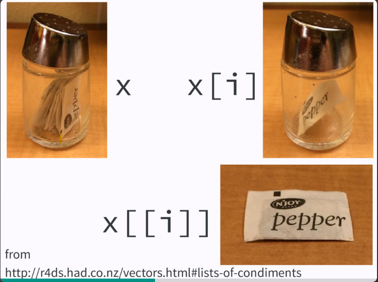
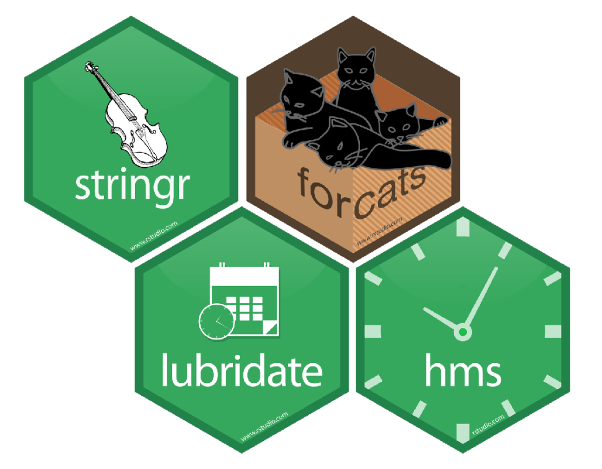

---
output:
  xaringan::moon_reader:
    lib_dir: libs
    css:  ["default", "default-fonts", "animate.css",  "hygge"]
    nature:
      highlightStyle: github
      highlightLines: true
      countIncrementalSlides: true
---
class: inverse, center
```{r , message=FALSE, warning=FALSE, include=FALSE} 
library(fontawesome)
library(emo)
```

# `r fa("r-project", fill = 'steelblue')`  para análisis de datos `r emo::ji("rocket")`<br> <br> 

## `r emo::ji("tada")`Tipos de datos `r emo::ji("computer")`<br> <br> <br> 

.large[Roxana N. Villafañe | LEMyP | <a href='http://twitter.com/data_datum'>`r fa("twitter", fill = 'steelblue')` @data_datum</a>] <br> 
.large[Florencia D'Andrea | INTA-CONICET | <a href="http://twitter.com/cantoflor_87"> `r fa("twitter", fill = 'steelblue')` @cantoflor_87</a><br>] 


<br><br><br><br><br> Slides disponibles en <https://bit.ly/curso-r-fca> `r emo::ji("sparkles")`
<br> Página web del curso en <https://curso-r-fca.netlify.com> `r emo::ji("star2")`


---


---


---

# Tipos de datos en `r fa("r-project", fill = 'steelblue')`

.pull-left[
## Vectores
## Matrices
## Factores
## Listas
## Dataframes
## Arreglos
]
.pull-right[

]

---

# Datos atómicos en `r fa("r-project", fill = 'steelblue')`

.pull-left[
### Decimal (double)
### Enteros (integer)
Decimales y enteros son "numeric"
<br>
### Complejos (complex)
<br>
### Caracteres (character)
<br>
### Lógicos o booleanos
]
.pull-right[
```{r } 
class(2.55)
class(7L)
class(2+2i)
class("string")
class(TRUE)
```
]

---
background-image: url(C:/Users/Roxana/curso-r-analisis-datos/img/pc5.jpg)
background-size: cover
class: center, middle

# `r emo::ji("sparkles")` Vectores


---

# Vectores `r fa("r-project", fill = 'steelblue')`

Conjunto de datos que puede ser numérico, de caracteres o booleano. 
<br>
Se crean mediante la función **c()**.
.pull-left[
```{r } 
num<-c(1,2,3)
num
string<-c('uno','dos')
string
boolean<-c(T,F,T,F)
boolean
```

]
.pull-right[

]

---

# Vectores `r fa("r-project", fill = 'steelblue')`

Otras funciones para crear vectores, en este caso, __secuencias__

Con el operador : se pueden crear secuencias crecientes o decrecientes
```{r eval=FALSE} 
20:50
100:50
```

.content-box-yellow[Mediante la función **seq()**]

```{r } 
v <- seq(from = 5, to = 15, by = 2)
v
```

.content-box-yellow[Mediante la función **rep()**]

```{r } 
y <- c(4, 8, -3)
z <- rep(y, times = 3)
z
```

---

# Funciones de vectores `r fa("r-project", fill = 'steelblue')`

.content-box-red[**length()**] Nos permite conocer la longitud de un vector


Para acceder a los elementos de un vector lo hacemos mediante corchetes []


```{r } 
v<-c(4,8,2,-123,-5)
v[2]
```

---
background-image: url(C:/Users/Roxana/curso-r-analisis-datos/img/pc1.jpg)
background-size: cover
class: center, middle, inverse

# `r emo::ji("sparkles")` Matrices
 

---

# Matrices en `r fa("r-project", fill = 'steelblue')`

Desde el punto de vista del lenguaje, una matriz es un vector con un atributo adicional: dim(). 

```{r } 
m <- 11:30 # creo una secuencia ascendente
m
```

```{r } 
dim(m)<-c(4,5) #la matriz tiene 4 filas y 5 columnas
m
```

```{r } 
class(m) # tipo de objeto en R
```

---

# Matrices en `r fa("r-project", fill = 'steelblue')`

Podemos crear matrices con la función .content-box-yellow[**matrix()**]

```{r } 
matrix(11:30, nrow=5, ncol=4) #las columnas se crean según columnas por defecto
```


```{r } 
matrix(11:30, nrow=5, ncol=4, byrow=T) # las creo según las filas
```

---

# Matrices en `r fa("r-project", fill = 'steelblue')`

También uniendo vectores mediante filas o columnas con las funciones **rbind()** 
```{r } 
m1 <- rbind(c(1.5, 3.2, -5.5), c(0, -1.1, 60)) #unir filas
m1
```

o con **cbind()**
```{r } 
m1 <- cbind(c(1.5, 3.2, -5.5), c(0, -1.1, 60)) #unir columnas
m1
```
---

# Funciones útiles en Matrices con `r fa("r-project", fill = 'steelblue')`


---

# Factores en `r fa("r-project", fill = 'steelblue')`

Son cadenas de caracteres que se usan para nombrar cosas y objetos. 
Generalmente son datos categóricos en un dataframe


```{r } 
persona <- c("Hugo", "Paco", "Luis", "Petra", "Maria", "Fulano")
mes.nacimiento <- c("Dic", "Feb", "Oct", "Mar", "Feb", "Nov")
```

Se pueden concatenar mediante **paste()**
```{r } 
paste(persona[3], "nació en el mes de", mes.nacimiento[4])
```

Podemos indexar elementos mediante **corchetes[]**

En el universo *Tidyverse*, los factores se procesan con la librería **forcats**


---

background-image: url(C:/Users/Roxana/curso-r-analisis-datos/img/pc2.jpg)
background-size: cover
class: center, middle, inverse

# `r emo::ji("sparkles")` Listas


---

# Listas en `r fa("r-project", fill = 'steelblue')`

Es un tipo de dato que puede contener elementos de igual o diferente clase. 
No sucede esto para matrices y arrays.

Creamos listas mediante la función .content-box-yellow[**list()**]

```{r } 
familia <- list(madre="Maria", padre="Juan", casados=10,
hijos=c("Hugo", "Petra"), edades=c(8, 6))
familia
```

Para operar con listas en *Tidyvserse* se utiliza el paquete **purrr**
---

# Indexación en Listas con [[ en `r fa("r-project", fill = 'steelblue')`


.footnote[Fuente: *R Advanced de Hadley Wickham* https://adv-r.hadley.nz/
]
---


# Indexación en Listas con [[ en `r fa("r-project", fill = 'steelblue')`


<br>
.footnote[Fuente: *R Advanced de Hadley Wickham* https://adv-r.hadley.nz/
]
---

# Indexación en Listas con [[ en `r fa("r-project", fill = 'steelblue')`




.footnote[Fuente: *Purrr workshop en LatinR2018* https://speakerdeck.com/jennybc/purrr-workshop
]

---

background-image: url(C:/Users/Roxana/curso-r-analisis-datos/img/pc3.jpg)
background-size: cover
class: center, middle, animated, lightSpeedIn

# `r emo::ji("sparkles")` Dataframes


---


# Dataframes en  `r fa("r-project", fill = 'steelblue')`

- Un dataframe es una lista cuyos componentes pueden ser vectores, matrices o factores. 
- El número de filas y de columnas coinciden, lo que hace que tenga apariencia de una tabla. 

Se puede crear un dataframe con la función .content-box-yellow[**data.frame()**]

```{r } 
sitios<-data.frame(sitios=1:4, muestreado=c(T,F,F,T))
sitios
```

```{r } 
is.data.frame(sitios) # permite saber que tipo de dato es 
```

---

# Dataframes en  `r fa("r-project", fill = 'steelblue')`

Los dataframes son los tipos de datos más comunes con los que se trabaja en R, junto con las listas y los arrays. 

<br>
.content-box-yellow[Para importar datos]

<br><br>


- Que están en excel ---> librería **readxl**


<br><br>


- Si están en .csv o .txt ---> desde r base o mediante **readr**


<br><br>


- Si el volumen de datos es grande ---> *fread* de **datatable**

- Si estamos en orden de GB ---> **vroom** 
Mas información en: https://www.tidyverse.org/blog/2019/05/vroom-1-0-0/ 


---

# Indexación en dataframes con `r fa("r-project", fill = 'steelblue')`

Los dataframes al ser un tipo especial de lista se puede acceder a sus elementos mediante [], [[]], y $

```{r } 
library(ggplot2)
head(mpg, 3)
```

```{r } 
mpg[1:3] #seleccionamos las primeras columnas
```
---

# Indexación en dataframes con `r fa("r-project", fill = 'steelblue')`

```{r } 
mpg[1,] #seleccionamos una fila
```

```{r } 
mpg[,3] #seleccionamos una columna
```
---


# Indexación en dataframes con `r fa("r-project", fill = 'steelblue')`

```{r } 
mpg[3,2] #seleccionamos un elemento concreto 
```

```{r } 
mpg[[4]] #seleccionamos una columna
```
---


# Indexación en dataframes con `r fa("r-project", fill = 'steelblue')`

```{r } 
mpg$year #seleccionamos una columna mediante el nombre de la variable
```


---

background-image: url(C:/Users/Roxana/curso-r-analisis-datos/img/pc8.jpg)
background-size: cover
class: center, middle, inverse

# `r emo::ji("sparkles")` Arrays

---

# Arrays con `r fa("r-project", fill = 'steelblue')`


---

background-image: url(C:/Users/Roxana/curso-r-analisis-datos/img/pc6.jpg)
background-size: cover
class: center, middle

# `r emo::ji("sparkles")` Recapitulamos

---

# `r emo::ji("cherries")`Recapitulando (tipos de datos) `r fa("r-project", fill = 'steelblue')`

.pull-left[


]
.pull-right[


]
.footnote[Fuente: *R Advanced de Hadley Wickham* https://adv-r.hadley.nz/
]
---

# `r emo::ji("cherries")`Recapitulando (tipos de datos) `r fa("r-project", fill = 'steelblue')`


---

# `r emo::ji("cherries")`Recapitulando `r fa("r-project", fill = 'steelblue')`


.footnote[Fuente: *R Advanced de Hadley Wickham* https://adv-r.hadley.nz/
]
---
background-image: url(C:/Users/Roxana/curso-r-analisis-datos/img/pc7.jpg)
background-size: cover
class: center, middle

# `r emo::ji("sparkles")` Tibbles


---


# Tibbles en `r fa("r-project", fill = 'steelblue')`

- Tibble es parte de **Tidyverse**. Presenta una estructura tabular, en filas y columnas. Los tibbles eliminan los rownames por defecto, para tener una mejor compatibilidad con bases SQL. 

- Dataframe sin embargo, es una estructura nativa de **rbase**, sin necesidad de instalar ningún paquete adicional. Se puede acceder a los elementos mediante **colnames()** o **rownames()**. 

- Ambas formas son intercambiables mediante los comandos 

```{r message=FALSE, warning=FALSE, eval=FALSE}
rbase::as.data.frame()
tidyverse::as_tibble()
```

--
- Slicing
```{r, message=FALSE, warning=FALSE, eval=FALSE}
iris$Sepal.Length #usando rbase
iris[["Sepal.Length"]]
```

```{r, message=FALSE, warning=FALSE, eval=FALSE, echo=FALSE}
tibble::as_tibble(iris)
```


```{r, message=FALSE, warning=FALSE, eval=FALSE}
iris %>% .$Sepal.Length #usando pipes
iris %>% .[["Sepal.Length"]]
```


---


# Opciones de Tidyverse 




---


# Bibliografía `r emo::ji("books")`de consulta `r fa("r-project", fill = 'steelblue')`


---

background-image: url(C:/Users/Roxana/curso-r-analisis-datos/img/textura-fondo.png)
background-size: cover
class: center, middle, inverse

 

# `r emo::ji("raising_hand")` ¿Preguntas?


---
```{r } 
sessionInfo() 
```


